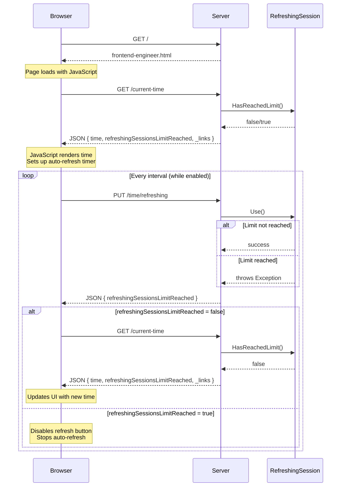
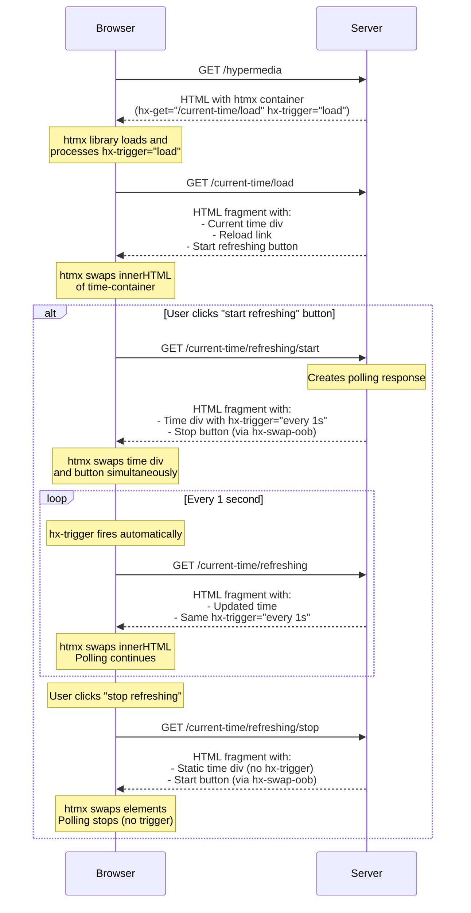
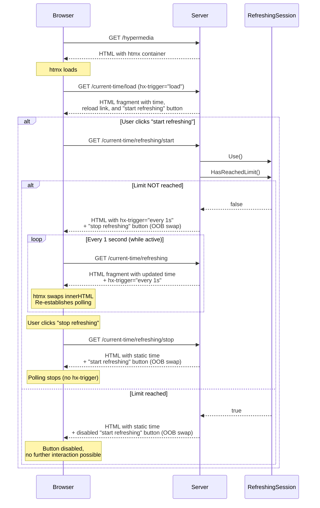

## Exercise - PART I
### Backend and Frontend Engineer Collaboration: introduction
Go to `./exercise` and find "backend-engineer.cs" and "frontend-engineer.html" files. Naming is not accidental here - we try to "simulate" two different roles in a web application development team: backend engineer and frontend engineer.

This application is meant to:
* show current server time 
* allow user starting and stopping time refreshing session (whenever a session is started, the server time is refreshed every second and presented to the user, until user stops the session)

Run the application and explore its current behavior.

### Backend and Frontend Engineer Collaboration: new requirement
We want to limit the usage of refreshing sessions to 5. Once user has used 5 sessions, the "start refreshing" button should be disabled.

**Hint**: you will need to modify both backend and frontend code to implement this requirement, one of the things to cover in satisfying this requirement is to update the state of the system whenever a user starts a refreshing session.

#### Sequence diagram

## Exercise - PART II
### HTMX and Hypermedia: introduction
Go to `./exercise` and implement the same set of initial requirements using HTMX and hypermedia principles:
* show current server time 
* allow user starting and stopping time refreshing session (whenever a session is started, the server time is refreshed every second and presented to the user, until user stops the session)

#### Sequence diagram

### HTMX and Hypermedia: new requirement
Now we want to satisfy the same requirement as before, but now using HTMX and hypermedia principles.

Use **no** javascript code, focus on server-side and hypermedia HTTP endpoints.

#### Sequence diagram
### HTMX and Hypermedia: sequence diagram

### Useful hints
You can peek solution by using `./check-solution.sh 1-json-to-hypermedia` script from the root of the repo.